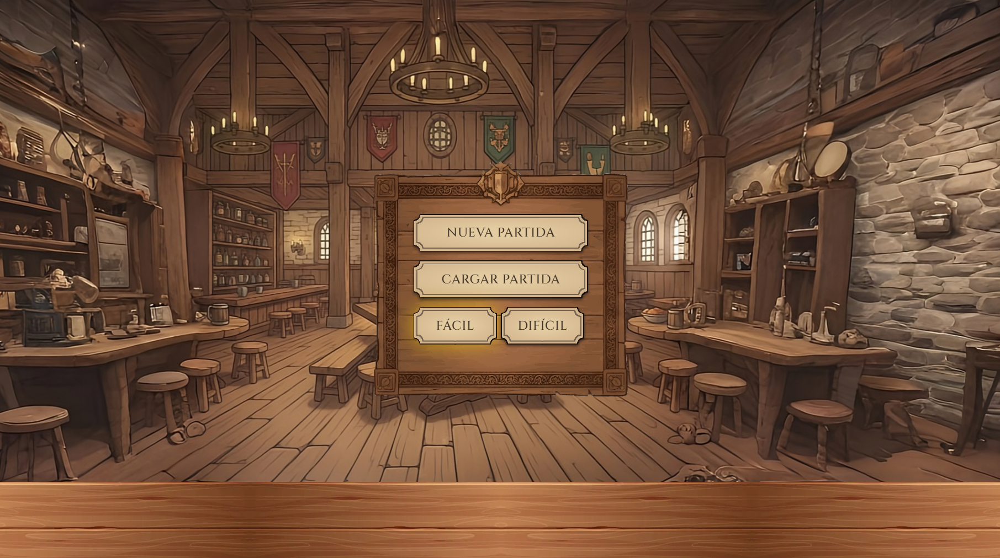
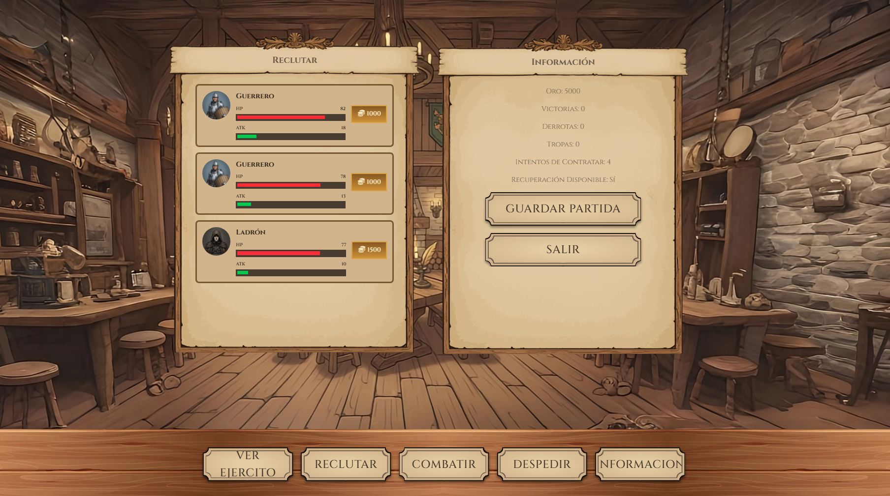
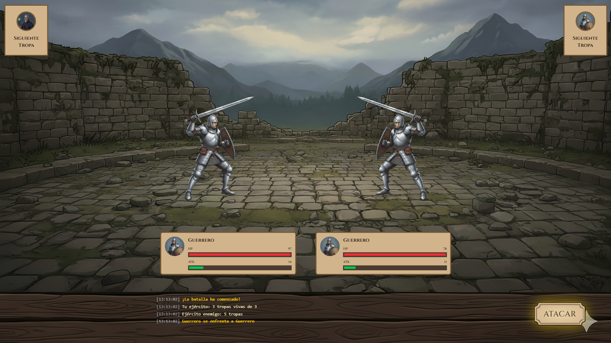

# Swords & Fireballs

## English

### About

Turn-based strategy game with three troop types (Warrior, Mage, Thief), each with unique abilities. Features a type advantage system (Mage > Warrior > Thief > Mage) and resource management.

### Screenshots





### Features

- **Turn-based combat** with type advantages (1.5x damage)
- **Three troop classes** with special abilities
- **Two difficulty modes** (Easy: 2 victories required / Hard: 4 victories required)
- **Asynchronous recruitment** with random shop generation
- **Save/Load system** via cookies (7 days)
- **Troop recovery** at 70% HP after battles
- **Draggable UI panels** for better UX

### How to Play

1. Choose difficulty and recruit troops (max 5)
2. Battle enemy armies (3-5 enemies)
3. Use special abilities strategically
4. Win: 2 victories (easy) / 4 victories (hard)
5. Lose: 2 defeats = game over

### Tech Stack

**Languages & Libraries:**
- JavaScript
- jQuery + jQuery UI
- Tailwind CSS
- Font Awesome

**Key Patterns:**
- Modular architecture with ES6 imports
- Centralized state management
- Event delegation
- Factory pattern for troop generation
- Promise.all() for async loading

### Installation

```bash
# Clone repository
git clone https://github.com/B4lla/Swords-Fireballs.git

# Run with local server
python -m http.server 8000
# or
npx http-server

# Open http://localhost:8000
```

### Structure

```
js/
├── clases/       # Character classes (Personaje, Guerrero, Mago, Ladron)
├── juego.js      # Game logic & state
├── funciones.js  # Combat & UI functions
├── utils.js      # Helpers & components
└── script.js     # Main controller
```

---

## Español

### Capturas


### Características

- **Combate por turnos** con ventajas de tipo (1.5x daño)
- **Tres clases de tropas** con habilidades especiales
- **Dos modos de dificultad** (Fácil: 2 victorias necesarias / Difícil: 4 victorias necesarias)
- **Reclutamiento asíncrono** con tienda aleatoria
- **Sistema de guardado** mediante cookies (7 días)
- **Recuperación de tropas** al 70% de vida
- **Paneles arrastrables** para mejor experiencia

### Como Jugar

1. Elige dificultad y recluta tropas (máx 5)
2. Combate contra ejércitos enemigos (3-5 enemigos)
3. Usa habilidades especiales estratégicamente
4. Ganar: 2 victorias (fácil) / 4 victorias (difícil)
5. Perder: 2 derrotas = fin del juego

### Tecnologías

**Lenguajes y Librerías:**
- JavaScript
- jQuery jQuery UI
- Tailwind CSS
- Font Awesome

**Patrones Clave:**
- Arquitectura modular con imports ES6
- Gestión centralizada de estado
- Delegación de eventos
- Patrón Factory para generación de tropas
- Promise.all() para carga asíncrona

### Instalación

```bash
# Clonar repositorio
git clone https://github.com/B4lla/Swords-Fireballs.git

# Ejecutar con servidor local
python -m http.server 8000
# o
npx http-server

# Abrir http://localhost:8000
```

### Estructura

```
js/
├── clases/       # Clases de personajes (Personaje, Guerrero, Mago, Ladron)
├── juego.js      # Lógica del juego y estado
├── funciones.js  # Funciones de combate y UI
├── utils.js      # Utilidades y componentes
└── script.js     # Controlador principal
```
